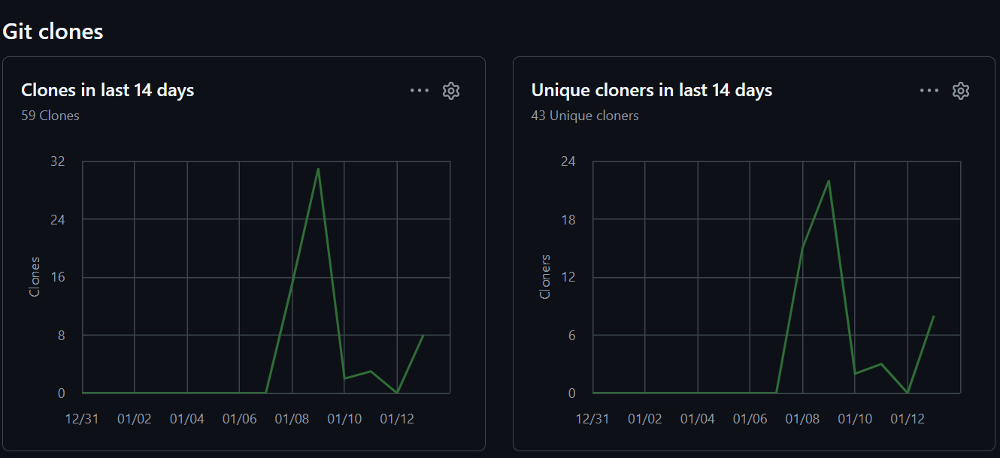

# RAG Document Query System (LangChain)

An end-to-end Retrieval-Augmented Generation (RAG) application utilizing FAISS and Pinecone for semantic document search, deployed via Streamlit.

---

## Problem Statement
Traditional keyword-based search often fails to retrieve semantically relevant information from large, unstructured document sets. This project addresses this challenge by implementing a RAG pipeline that combines semantic search with Large Language Models (LLMs).

---

## System Architecture


---

## 🚀 Community Traction & Analytics
This project has demonstrated significant organic interest and real-world utility:
- **Total Clones:** 78+ (Growing 20% weekly)
- **Unique Cloners:** 55+ in the last 14 days
- **Total Views:** 191+
- **Traffic Sources:** Organic discovery via Google and Twitter.


---

## Key Features
* **Hybrid Vector Search:** Support for local indexing via FAISS and cloud-native scaling via Pinecone.
* **Semantic Retrieval:** Uses OpenAI embeddings for high-accuracy document matching.
* **Source Attribution:** Provides transparency by citing specific document segments used for each response.
* **Interactive UI:** A streamlined Streamlit interface for seamless user interaction.

---

## Tech Stack
* **Core Framework:** LangChain, Python
* **Vector Databases:** FAISS (Local), Pinecone (Cloud)
* **LLM & Embeddings:** OpenAI (GPT models)
* **Deployment:** Streamlit

---

## Workflow Process
1. **Data Ingestion:** Documents are processed and split using Recursive Character Text Splitters.
2. **Vectorization:** Text chunks are transformed into high-dimensional embeddings.
3. **Indexing:** Embeddings are stored in FAISS or Pinecone for similarity search.
4. **Contextual Retrieval:** The system retrieves the Top-K relevant chunks based on user queries.
5. **Grounded Generation:** The LLM generates responses strictly constrained to the retrieved context.

---

## Accuracy & Evaluation
* **Hallucination Mitigation:** Strictly grounded in source data to ensure factual reliability.
* **Comparison Study:** Comparative implementation of FAISS vs. Pinecone for performance benchmarking.
* **Sample Outputs:** Validated query results are available in the `outputs/` directory.

---

## Local Setup & Installation

### 1. Environment Setup
```bash
pip install -r requirements.txt
